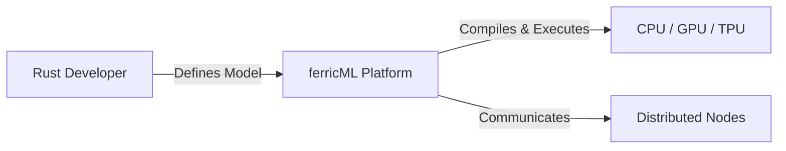
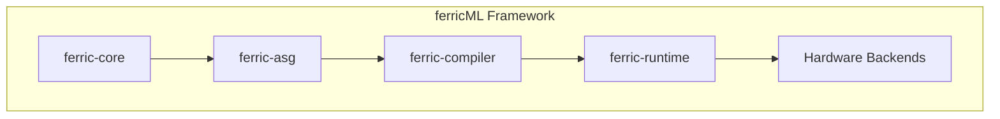

# Architecture Specification: ferricML
v.0.0.01

## Table of Contents
- [1. Introduction](#1-introduction)
- [2. Product & User Requirements](#2-product--user-requirements)
- [3. Acceptance Criteria](#3-acceptance-criteria)
- [4. System Architecture](#4-system-architecture)
- [5. External Interfaces & Integrations](#5-external-interfaces--integrations)
- [6. Constraints & Assumptions](#6-constraints--assumptions)
- [7. Appendices (Detailed Implementation)](#7-appendices-detailed-implementation)
- [Appendix R - Revision History](#appendix-r---revision-history)

---

## 1. Introduction
### 1.1. Document Purpose and Audience
This document provides a comprehensive technical architecture for ferricML, an end-to-end ML platform for Rust. It serves as the single source of truth for implementation, integrating concepts from neural networks, tree-based models, and probabilistic models.

### 1.2. Product/System Overview
ferricML is a pure-Rust machine learning framework that provides both eager execution for rapid prototyping and graph compilation for production performance. It utilizes a multi-level IR (FML-IR) stack and targets CPU, CUDA, ROCm, and TPU.

### 1.3. Problem Statement & Vision
Currently, Rust developers must choose between high-level bindings to C++ frameworks or low-level libraries. ferricML provides a unified, native platform that leverages Rust's safety and performance while maintaining the ergonomics of PyTorch.

### 1.4. Goals & Objectives
- **Safety:** 100% pure Rust for the core execution engine.
- **Performance:** Within 10% of native backend performance via MLIR-based optimization.
- **Portability:** Unified API across diverse hardware (CPU/GPU/TPU).

### 1.5. Definitions, Acronyms, and Abbreviations
- **ASG:** Abstract Semantic Graph
- **AOT-AD:** Ahead-of-Time Automatic Differentiation
- **SSA:** Static Single Assignment
- **MLIR:** Multi-Level Intermediate Representation

### 1.6. References
1. LLVM & MLIR Language References.
2. StableHLO Specification.

---

## 2. Product & User Requirements
### 2.1. Target Audience & User Personas
- **ML Researchers:** Require dynamic tracing and ease of debugging.
- **Production Engineers:** Require static graph optimization and stable deployment formats.

### 2.2. User Scenarios / Use Cases
- Training deep neural networks with complex control flow.
- Deploying low-latency tree-based inference on the edge.
- Distributed training across multi-GPU clusters.

### 2.3. Core Functional Requirements
Refer to `docs/ferricML_requirements.md` for the full list of FML-FUNC requirements.

### 2.4. Non-Functional Requirements
Refer to `docs/ferricML_requirements.md` for the full list of FML-NFR requirements.

---

## 3. Acceptance Criteria

### 3.1. Functional Requirements Acceptance

| Requirement ID | Acceptance Criterion | Verification Method |
| :--- | :--- | :--- |
| **FML-FUNC-001** | Symbolic Tensor must record op in ASG without immediate allocation. | Unit test verifying deferred allocation. |
| **FML-FUNC-002** | IR must support L1, L2, and L3 dialects with lowering passes. | Compiler pass test emitting valid textual format. |
| **FML-FUNC-003** | `#[ferric::compile]` must trace control flow correctly. | Macro expansion verification. |
| **FML-FUNC-004** | AOT-AD must generate gradient nodes in the L1 IR. | Inspection of differentiated IR. |
| **FML-FUNC-005** | Neural Network training must decrease loss on standard MNIST task. | Integration test (Training run). |
| **FML-FUNC-006** | GBDT must support histogram-based splits. | Comparison against reference implementations. |
| **FML-FUNC-007** | PGM must support Variable Elimination. | Logical check of joint probability results. |
| **FML-FUNC-008** | CUDA backend must utilize WMMA for Tensor Cores. | PTX inspection for `wmma` instructions. |
| **FML-FUNC-009** | CPU backend must support AVX-512. | SIMD instruction verification. |
| **FML-FUNC-010** | Distributed training must scale linearly up to 4 GPUs. | Speedup ratio benchmark. |
| **FML-FUNC-011** | `ShapeGuard` must detect shape mismatch and trigger fallback. | Runtime fallback test case. |
| **FML-FUNC-012** | Model serialization must be bit-identical. | Hash comparison of serialized data. |
| **FML-FUNC-013** | Operator fusion must reduce kernel count. | Kernel launch telemetry comparison. |
| **FML-FUNC-014** | MPA must insert BF16 casts automatically. | IR inspection for `fml.cast` ops. |
| **FML-FUNC-015** | SVM must solve dual problem via SMO. | Convergence verification on SVM task. |

### 3.2. Non-Functional Requirements Acceptance

| Requirement ID | Acceptance Criterion | Verification Method |
| :--- | :--- | :--- |
| **FML-NFR-001** | No non-Rust dependencies in the core runtime. | `cargo tree` audit. |
| **FML-NFR-002** | Default log level is `NOTICE`. | Initialization test. |
| **FML-NFR-003** | GEMM performance within 10% of cuBLAS. | Performance benchmarking. |
| **FML-NFR-004** | UVA must allow direct device-to-device pointers. | Memory pointer validity test. |
| **FML-NFR-005** | Allocation latency must be below 100μs. | Micro-benchmarking (Criterion). |
| **FML-NFR-008** | Fault-tolerant recovery in under 5 minutes. | Node failure simulation. |

---

## 4. System Architecture

### 4.1. Architectural Goals & Constraints
The architecture must maximize throughput and minimize latency while providing a safe, multi-paradigm environment. Constraints include the strict requirement for static shapes on TPU backends.

### 4.2. Architectural Principles
- **Backend Decorator Pattern:** Separation of concerns between AD logic and hardware execution.
- **Progressive Lowering:** IR transformations that preserve semantic intent at high levels and optimize memory at low levels.

### 4.3. System Context Diagram (C4 Level 1)


### 4.4. Modular Decomposition Diagram (C4 Level 2/3)


### 4.5. Logical View (Component Diagram)
- **Frontend:** API and Procedural Macros.
- **Middleware:** ASG and AOT-AD Engine.
- **Compiler:** Pass Manager and MLIR Dialects.
- **Runtime:** Storage, Allocators, and Dispatchers.

### 4.6. Process View (Runtime/Concurrency Diagram)
Tracing -> ASG Construction -> AOT-AD -> L1 IR -> L2 IR (Fusion) -> Bufferization -> L3 IR (Codegen) -> Execution.

### 4.7. Physical View (Deployment Diagram)
- **Client Application:** Links `ferricML` as a library.
- **Worker Nodes:** Distributed execution processes for multi-node training.

### 4.8. Data View (High-Level Schema & Data Flow)
- **Input:** Tensors and Hyperparameters.
- **Internal:** ASG Nodes and IR SSA values.
- **Output:** Serialized Model Artifacts.

### 4.9. Data Models
Tensors are defined by their `DType`, `Shape`, and `Device`. ASG nodes store `OpType` and input/output references.

### 4.10. Key Architectural Decisions & Rationale
- **Decision:** Use an MLIR-inspired stack. **Rationale:** Provides the best path for multi-hardware support and reuses industry-standard optimization logic.
- **Decision:** Pure Rust Execution. **Rationale:** Eliminates the Python runtime overhead and ensures total memory safety for large-scale training.

### 4.11. Architecture Decision Records (ADRs)
- **ADR-001:** Adopting melior for MLIR bindings to ensure stable integration with LLVM infrastructure.

### 4.12. Paths Not Taken
- **Source-to-C++ Translation:** Rejected due to excessive compile times and difficulty in maintaining safety guarantees.

### 4.13. Technical Non-Functional Requirements
- **Thread-Safety:** All shared components must be `Send + Sync`.
- **Liveness Analysis:** Must be performed in O(N) time for efficient compilation.

### 4.14. User Experience (UX) & User Interface (UI) Design
APIs are designed to be builder-centric for model definition and functional for tensor manipulation. Error messages must leverage Rust's diagnostic system to provide actionable feedback during macro expansion.

### 4.15. Component Responsibility Collaborator (CRC) Cards
- **Compiler:** Responsibilities include lowering and fusion. Collaborates with Dialects and PassManager.
- **Runtime:** Responsibilities include allocation and launch. Collaborates with Storage and Streams.

### 4.16. Sequence Diagrams
1. User calls `model.forward()`.
2. Macro traces call into ASG.
3. AD engine generates backward graph.
4. Pass manager applies fusion.
5. Backend emits PTX/SASS.

### 4.17. Logging and Monitoring
- **Logging Strategy:** 8-level system (Emergency to Debug).
- **Default Level:** `NOTICE`.
- **Configuration:** Set via `FERRIC_LOG` environment variable.
- **Monitoring:** Integrated telemetry for GPU memory and power via sidecar hooks.

### 4.18. Primary Dependencies
- `melior`
- `llvm-sys`
- `rayon`
- `serde`
- `cuda-sys` / `hip-sys`

---

## 5. External Interfaces & Integrations
### 5.1. External System Interfaces
- **XLA:** Lowering interface for TPUs.
- **NCCL:** Multi-GPU communication protocol.

### 5.2. Third-Party Integrations
- Support for ONNX model import/export for cross-framework compatibility.

### 5.3. API Specifications (External)
C-compatible ABI for the runtime to allow linking into non-Rust production environments.

---

## 6. Constraints & Assumptions
### 6.1. Technical Constraints
- Requires modern GPUs with support for FP16/BF16 for optimal MPA performance.

### 6.2. Business Constraints
- Distributed training requires high-bandwidth interconnects (e.g., InfiniBand) for linear scaling.

### 6.3. Assumptions
- Host system has `rustc` and `clang` (LLVM) toolchains installed.

---

## 7. Appendices (Detailed Implementation)

### 7.1. Section I: Core Type System & Memory Model Implementation

#### 7.1.1. DType Trait and Scalar Systems
```rust
pub trait DType: Copy + Send + Sync + 'static {
    const SIZE: usize;
    const ALIGNMENT: usize;
    const ZERO: Self;
    const ONE: Self;
    const TYPE_ID: TypeId;
    const SIMD_CAPABLE: bool;
    const SIMD_WIDTH: usize;
    fn from_f64(val: f64) -> Self;
    fn to_f64(self) -> f64;
}

#[repr(u8)]
#[derive(Debug, Clone, Copy, PartialEq, Eq, Hash)]
pub enum TypeId {
    Float16 = 0, BFloat16 = 1, Float32 = 2, Float64 = 3,
    Int8 = 4, Int16 = 5, Int32 = 6, Int64 = 7,
    UInt8 = 8, UInt16 = 9, UInt32 = 10, UInt64 = 11,
    Bool = 12, Complex64 = 13, Complex128 = 14,
    QInt8 = 15, QUInt8 = 16, QInt32 = 17,
}
```

#### 7.1.2. Memory Model and Allocators
ferricML uses a multi-tier memory strategy. The `MemoryPool` implements a B-Tree for free block tracking to ensure $O(\log N)$ allocation time.
```rust
pub struct MemoryPool {
    free_blocks: BTreeMap<usize, Vec<*mut u8>>,
    allocated: HashMap<*mut u8, BlockInfo>,
    total_allocated: AtomicUsize,
    device: Device,
}

impl MemoryPool {
    pub fn allocate(&mut self, size: usize, alignment: usize) -> Result<*mut u8> {
        let size = size.next_power_of_two();
        if let Some(blocks) = self.free_blocks.get_mut(&size) {
            if let Some(ptr) = blocks.pop() {
                return Ok(ptr);
            }
        }
        self.allocate_new(size, alignment)
    }
}
```

#### 7.1.3. Storage Backend Implementation
```rust
pub enum Storage {
    Cpu(CpuStorage),
    Cuda(CudaStorage),
    Rocm(RocmStorage),
    Tpu(TpuStorage),
}

pub struct CpuStorage {
    ptr: *mut u8,
    len: usize,
    capacity: usize,
    alignment: usize,
    allocator: Option<Arc<dyn Allocator>>,
}
```

#### 7.1.4. Tensor Views and Zero-Copy
```rust
impl<T: DType> Tensor<T> {
    pub fn view(&self, new_shape: &[usize]) -> Result<Self> {
        Ok(Self {
            storage: Arc::clone(&self.storage),
            shape: Shape::new(new_shape),
            strides: Strides::contiguous(&Shape::new(new_shape)),
            offset: self.offset,
            device: self.device.clone(),
            ..self
        })
    }
}
```

### 7.2. Section II: FML Intermediate Representation (FML-IR)

#### 7.2.1. IR Structure and SSA Form
```rust
pub struct Module {
    name: String,
    functions: Vec<Function>,
    types: TypeTable,
}

pub struct Operation {
    id: OpId,
    kind: OpKind,
    operands: Vec<Value>,
    results: Vec<Value>,
    result_types: Vec<Type>,
    attributes: AttributeDict,
}
```

#### 7.2.2. Dialect System
1. **L1 (Tensor):** High-level operations.
2. **L2 (Structured):** Loop-nest optimization using `linalg.generic`.
3. **L3 (Target):** Hardware-specific primitives.

#### 7.2.3. Affine Maps for Memory Indexing
```rust
pub struct AffineMap {
    num_dims: usize,
    num_symbols: usize,
    results: Vec<AffineExpr>,
}

pub enum AffineExpr {
    Dim(usize),
    Symbol(usize),
    Constant(i64),
    Add(Box<AffineExpr>, Box<AffineExpr>),
    Mul(Box<AffineExpr>, Box<AffineExpr>),
}
```

#### 7.2.4. Control Flow and CFG
Basic blocks represent the structure of the computation graph. Terminators (`br`, `cond_br`, `return`) define the edges of the CFG.

### 7.3. Section III: Dynamic Graph Capture & AOT-AD Engine

#### 7.3.1. ASG Node Structure
```rust
pub struct ASGNode {
    pub op_type: OpType,
    pub inputs: Vec<u64>,
    pub requires_grad: bool,
    pub backward_closure: Box<dyn Fn(Vec<Tensor>) -> Vec<Tensor>>,
}
```

#### 7.3.2. Safe Tracing and ShapeGuards
Tracing occurs during the first run. The `ShapeGuard` validates subsequent executions.
```rust
pub struct ShapeGuard {
    recorded_shapes: Vec<Shape>,
    control_flow_path: Vec<bool>,
}
```

#### 7.3.3. AOT-AD Reverse Traversal
The engine performs a reverse topological sort on the ASG and applies backward closures to generate the adjoint graph.

### 7.4. Section IV: CUDA Backend Implementation

#### 7.4.1. NVVM/PTX Lowering Pipeline
L3 IR is lowered to the NVVM dialect, which is then compiled to PTX by the LLVM NVPTX backend.

#### 7.4.2. Tensor Core Integration (WMMA)
```cuda
#include <mma.h>
using namespace nvcuda;
__global__ void tensor_core_matmul(const half* A, const half* B, float* C) {
    wmma::fragment<wmma::matrix_a, 16, 16, 16, half, wmma::row_major> a_frag;
    // ... load, mma, store
}
```

#### 7.4.3. Shared Memory Tiling and Occupancy
Tiling passes analyze the iteration space and insert shared memory buffers to maximize throughput. Occupancy is optimized by adjusting block sizes.

#### 7.4.4. Stream Management
Asynchronous execution is handled via a `StreamPool`.

### 7.5. Section V: CPU Backend & Vectorization

#### 7.5.1. LLVM Code Generation
Utilizes JIT for custom kernels and AOT for standard primitives.

#### 7.5.2. SIMD Abstractions (AVX-512, NEON)
Trait-based vectorization allows unified code for Intel and ARM hardware.
```rust
pub trait SimdOps<T> {
    type Vector;
    fn load_unaligned(ptr: *const T) -> Self::Vector;
    fn fma(a: Self::Vector, b: Self::Vector, c: Self::Vector) -> Self::Vector;
}
```

#### 7.5.3. Cache-Aware Tiling
Matrix operations use blocked layouts to maximize L1/L2 cache locality.

#### 7.5.4. NUMA Awareness and Thread Pools
Work-stealing pools balance load, while NUMA binding prevents memory performance degradation across sockets.

### 7.6. Section VI: ROCm & TPU Backend Integration

#### 7.6.1. ROCDL/HSACO Pipeline
Targets AMD GPUs through the ROCm compiler stack.

#### 7.6.2. StableHLO/XLA Integration
The primary path for TPU acceleration. Strict shape specialization is enforced before lowering to StableHLO.

### 7.7. Section VII: Automatic Differentiation Engine

#### 7.7.1. Tape-Based Recording
During eager mode, operations are recorded on a `ComputationTape`.
```rust
pub struct TapeEntry {
    op: Operation,
    inputs: Vec<TensorId>,
    output: TensorId,
    grad_fn: Arc<dyn GradientFunction>,
}
```

#### 7.7.2. Reverse-Mode Algorithms
Implements standard backpropagation with support for higher-order derivatives via adjoint-of-adjoint computation.

#### 7.7.3. Custom Gradients
Users can define custom gradient functions using a specialized macro.

### 7.8. Section VIII: Optimization Pass Infrastructure

#### 7.8.1. Pass Manager and Pattern Rewriting
A unified manager orchestrates passes. Pattern matching enables algebraic simplifications.
```rust
pub struct RewriteRule {
    pattern: Pattern,
    replacement: Box<dyn ReplacementFn>,
}
```

#### 7.8.2. Operator Fusion (Vertical/Horizontal)
Combines adjacent operations into a single kernel to reduce memory traffic.

#### 7.8.3. Mixed-Precision Analysis (MPA)
Statically optimizes for reduced precision where safe.

#### 7.8.4. Bufferization and BReO
Memory planning pass that minimizes peak allocation through buffer reuse.

### 7.9. Section IX: Neural Network Modules

#### 7.9.1. Module Trait and Parameter Management
```rust
pub trait Module: Send + Sync {
    fn forward(&self, input: Tensor) -> Result<Tensor>;
    fn parameters(&self) -> Vec<&Parameter>;
}
```

#### 7.9.2. Transformer Architecture Components
Includes detailed implementations for Self-Attention and FFN blocks.

### 7.10. Section X: Tree-Based Models & Ensemble Methods

#### 7.10.1. Histogram-Based GBDT
Optimized split finding using binned features.

#### 7.10.2. Exclusive Feature Bundling (EFB)
Reduces feature count by merging non-conflicting features.

#### 7.10.3. Gradient-based One-Side Sampling (GOSS)
Accelerates training by focusing on samples with larger gradients.

### 7.11. Section XI: Probabilistic Graphical Models

#### 7.11.1. Exact Inference (Variable Elimination)
Sequential marginalization of potential factors.

#### 7.11.2. Approximate Inference (Gibbs, VI)
MCMC and Variational methods for large or continuous networks.

#### 7.11.3. HMM Implementation (Viterbi, Forward-Backward)
Dynamic programming for sequence modeling.

### 7.12. Section XII: Distributed Training & Serialization

#### 7.12.1. Distributed Data Parallel (DDP)
Multi-GPU training with synchronous gradient averaging.

#### 7.12.2. Pipeline Parallelism and Microbatching
Overlap of computation and communication for massive models.

#### 7.12.3. Model Serialization and Fault Tolerance
Bincode/FlatBuffers for checkpoints. Automated recovery from state snapshots.

---

## Appendix R - Revision History
| Version | Date | Author | Changes |
|---|---|---|---|
| 0.0.01  | 2025-11-20 | Jules | Comprehensive integration of all 10 technical sections into a unified document. |
